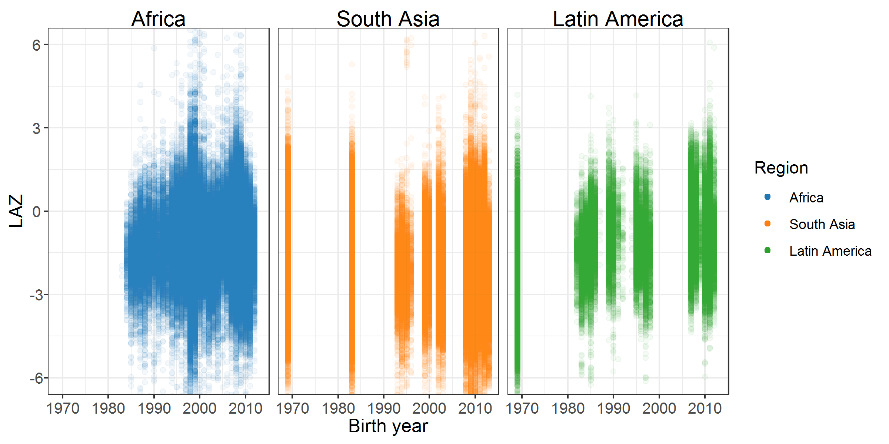

# Assessment of potential secular trends {#secular-trends}

---
output:
  pdf_document:
    keep_tex: yes
fontfamily: mathpazo
fontsize: 9pt
---

\raggedright

This study included cohorts that measured child growth from 1969 to 2014. To assess potential secular trends, we plotted the mean length-for-age Z-score (LAZ) over time. The plot below shows the individual observations from included studies over this range of years. There does not appear to be a secular trend in LAZ. 

```{r setup, include=FALSE}
library(knitr)
knitr::opts_chunk$set(echo = TRUE)
setwd("../../")
source("0-config.R")

```


```{r prev-re, echo = FALSE}
# include_graphics(paste0(here::here(), "/figures/shared/laz_secular_trend.png"))

```


