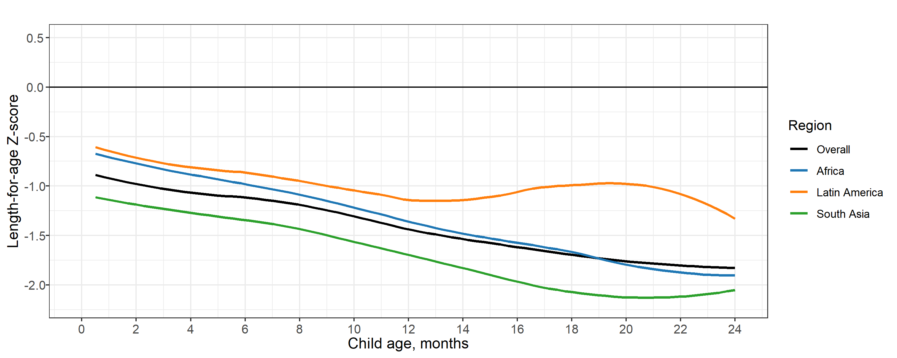
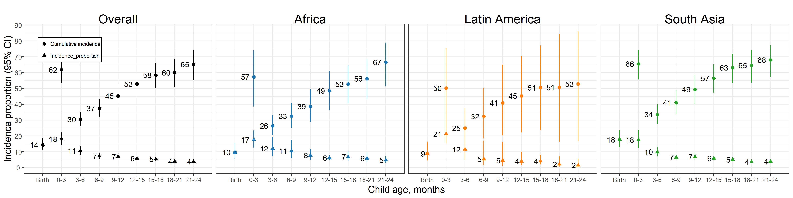

# Primary analyses excluding the PROBIT study {#exclude-PROBIT}

---
output:
  pdf_document:
    keep_tex: yes
fontfamily: mathpazo
fontsize: 9pt
---

\raggedright

xxx

```{r setup, include=FALSE}
library(knitr)
knitr::opts_chunk$set(echo = TRUE)
# setwd("../../")
# source("0-config.R")

```

<!-- ##################################################################################### -->
## Mean length-for-age Z-score by age

### Including PROBIT
```{r mean, echo = FALSE}
#include_graphics(paste0(here::here(), "/figures/stunting/fig-laz-2-mean-overall_region--allage-primary.png"))

```

### Excluding PROBIT
```{r mean-np, echo = FALSE}
#include_graphics(paste0(here::here(), "/figures/stunting/fig-laz-2-mean-overall_region--allage-primary_no_probit.png"))

```


<!-- ##################################################################################### -->
## Age-specific prevalence

### Including PROBIT
```{r prev, echo = FALSE}
#include_graphics(paste0(here::here(), "/figures/stunting/fig-stunt-2-prev-overall_region--allage-primary.png"))
include_graphics("figure-copies/fig-stunt-2-prev-overall_region--allage-primary.png")
```

### Excluding PROBIT
```{r prev-np, echo = FALSE}
#include_graphics(paste0(here::here(), "/figures/stunting/fig-stunt-2-prev-overall_region--allage-primary_no_probit.png"))
include_graphics("figure-copies/fig-stunt-2-prev-overall_region--allage-primary_no_probit.png")
```

<!-- ##################################################################################### -->
## Age-specific incidence

### Including PROBIT
```{r inc, echo = FALSE}
#include_graphics(paste0(here::here(), "/figures/stunting/fig-stunt-2-prev-overall_region--allage-primary.png"))
include_graphics("figure-copies/fig-stunt-2-prev-overall_region--allage-primary.png")
```

### Excluding PROBIT
```{r inc-np, echo = FALSE}
#include_graphics(paste0(here::here(), "/figures/stunting/fig-stunt-2-inc-overall_region--allage-primary.png ))

```


