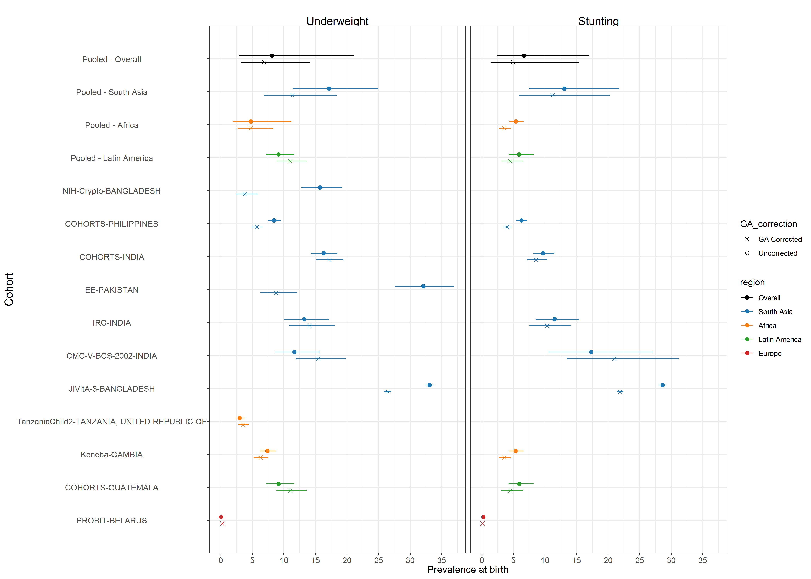

# Analyses of gestational age {#gestational}

---
output:
  pdf_document:
    keep_tex: yes
fontfamily: mathpazo
fontsize: 9pt
---

\raggedright

xxx

```{r setup, include=FALSE}
library(knitr)
knitr::opts_chunk$set(echo = TRUE)
setwd("../../")
source("0-config.R")
```


```{r prev-re, echo = FALSE}
#include_graphics(paste0(here::here(), "/figures/shared/fig-GA-correction-sensitivity.png"))

```


