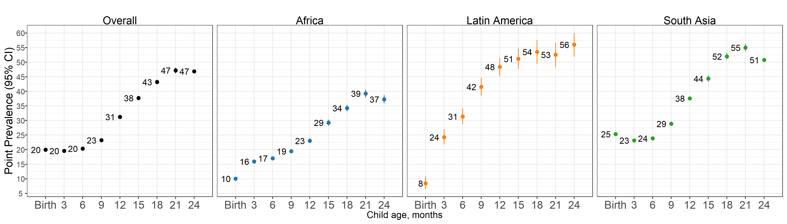

# Sensitivity analysis using fixed effects {#fixed-effects}

The primary analyses presented in this manuscript pooled across individual studies using random effects. Inferences about estimates from fixed effects models are restricted to only the included studies.[^1] The random effects approach was more conservative in the presence of study heterogeneity, as evidenced by larger confidence intervals around each point estimates. Overall, the inference from results produced by each method was similar. 

<!-- ##################################################################################### -->
## Age-specific prevalence

### Random effects

### Fixed effects

[ADD CAPTION]

<!-- ##################################################################################### -->
## Age-specific incidence

### Random effects

### Fixed effects

[ADD CAPTION]

<!-- ##################################################################################### -->
## Changes in stunting status by age

### Random effects

### Fixed effects

[ADD CAPTION] 

<!-- ##################################################################################### -->
## Linear growth velocity

### Random effects

### Fixed effects

[ADD CAPTION]

[^1]: Hedges, L. V. & Vevea, J. L. Fixed- and random-effects models in meta-analysis. Psychol. Methods 3, 486–504 (1998).
