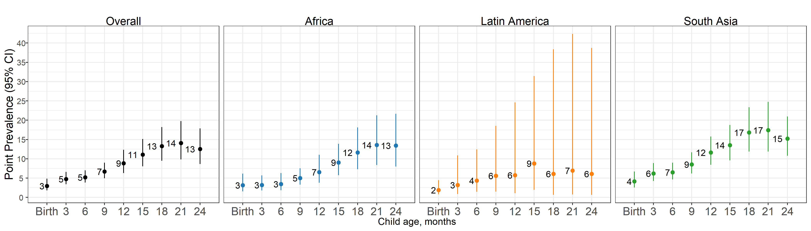

# Severe stunting analyses {#severe-stunting}

---
output:
  pdf_document:
    keep_tex: yes
fontfamily: mathpazo
fontsize: 9pt
---

\raggedright

Below, we display plots for the age-specific prevalence and cumulative incidence of severe stunting (LAZ < -3). Overall, the patterns are the same as for stunting (LAZ < -2), with the peak in prevalence at ages 18-24 months and the highest incidence proportion from 0-3 months. 

## Age-specific severe stunting prevalence

## Age-specific severe stunting incidence

