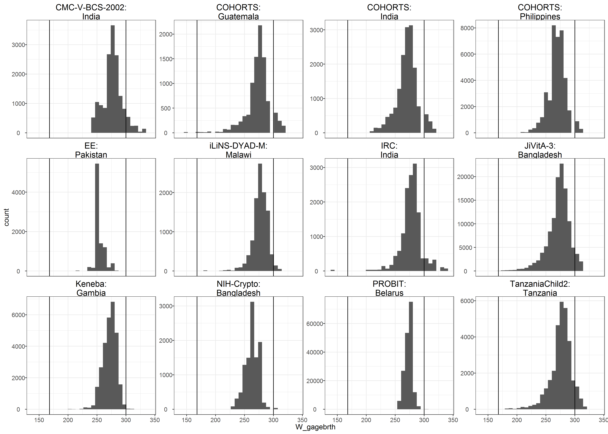

# Analyses of gestational age {#gestational}

---
output:
  pdf_document:
    keep_tex: yes
fontfamily: mathpazo
fontsize: 9pt
---

\raggedright

[sentence summarizing data we do not have]
To assess X, we compared stunting prevalence at birth when correcting at-birth Z-scores in cohorts measuring gestational age using the intergrowth standards to those in our primary analysis. As expected, the prevalence at birth decreased after correcting for gestational age, but this pattern varied between cohorts. I think this is largely from the poor quality of gestational age at birth data. Some prevalences increase after GA correction because of many late-term births based on GA. SAS-Compfeed had a dramatic decrease in prevalence, but more than 3/4 of infants are preterm based on the GA data. One note: I'm dropping observations with GA outside of the intergrowth standards range for both the corrected and uncorrected data. 

## Cohort-specific histograms of gestational age at birth in days

## Stunting prevalence with and without gestational age correction

