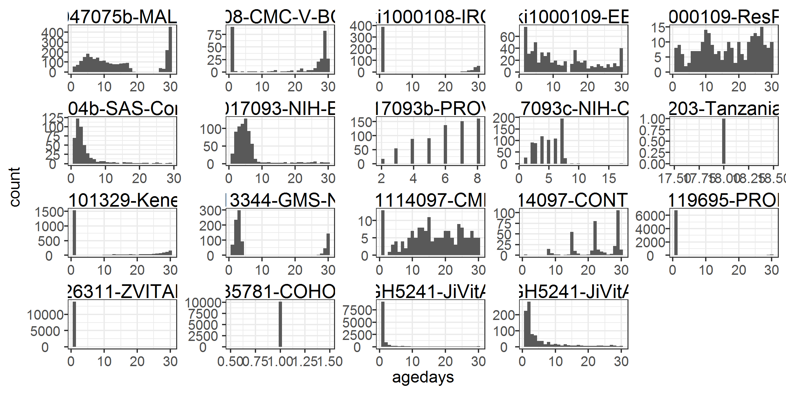
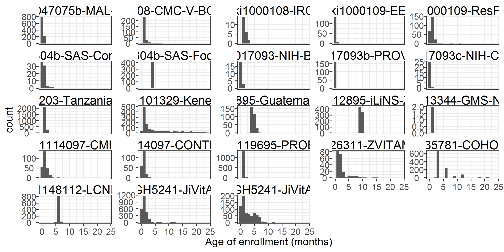

# Analyses of age at first measurement {#age-meas}

---
output:
  pdf_document:
    keep_tex: yes
fontfamily: mathpazo
fontsize: 9pt
---

\raggedright

xxx

## Histogram of age from 0-30 days

### All cohorts

### Cohort-stratified

## Histogram of age at enrollment

### All cohorts

### Cohort-stratified

