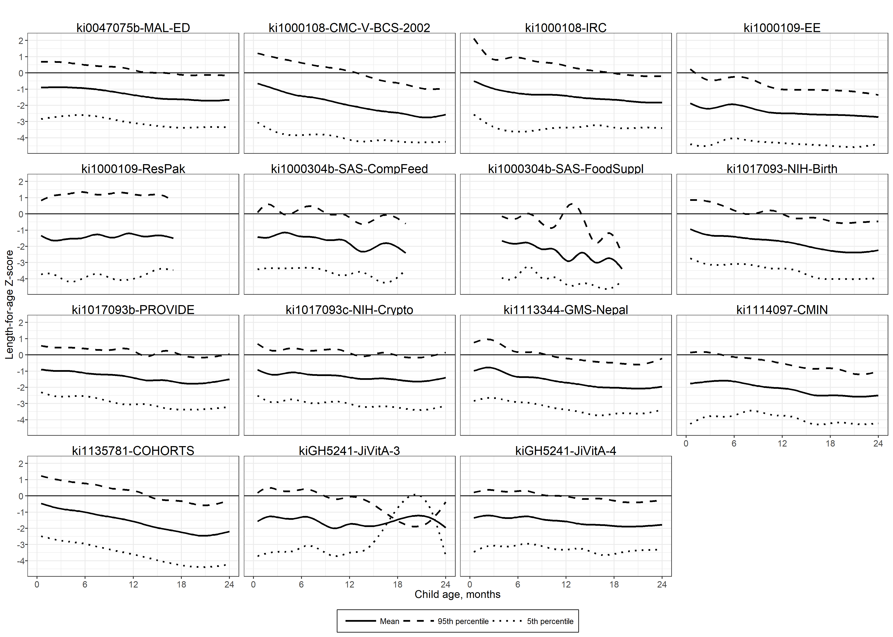
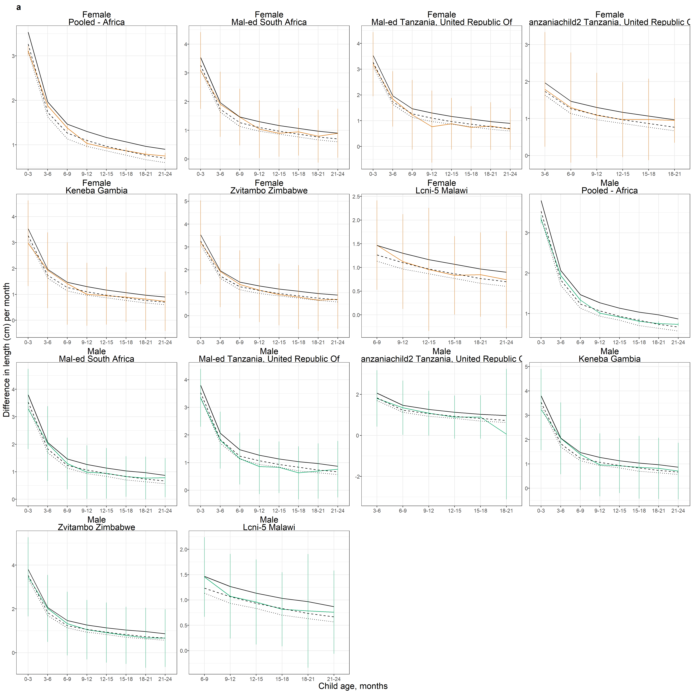
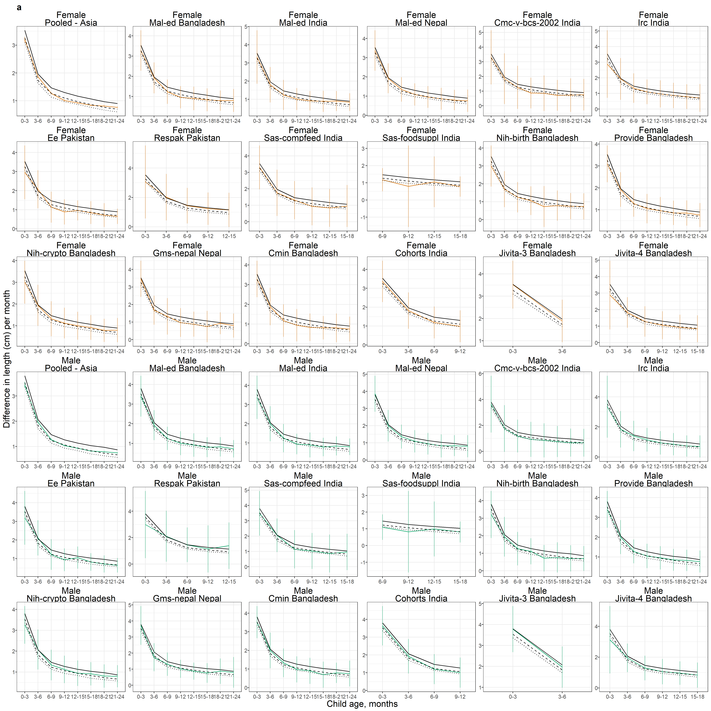
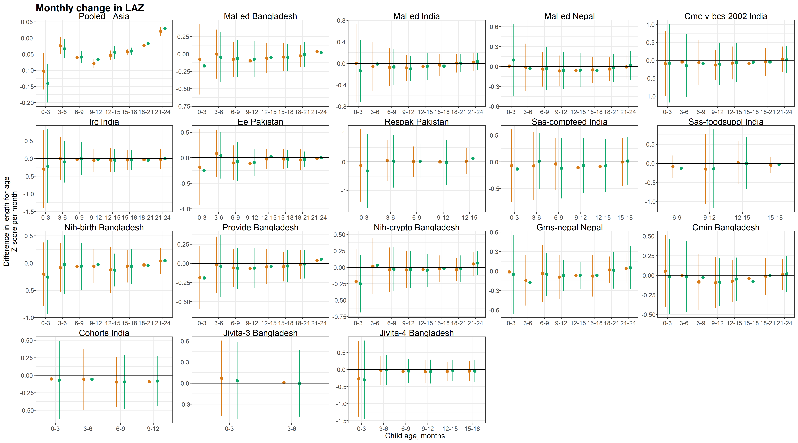

# Cohort-specific results {#cohort}

\raggedright

Here, we present cohort-specific estimates of length-for-age Z-score by age, age-specific prevalence, and age-specific incidence. 

<!-- ##################################################################################### -->
## Mean length-for-age Z-score by age

### Africa

### Latin America

### South Asia

<!-- ##################################################################################### -->
## Age-specific prevalence

### Africa

### Latin America

### South Asia

<!-- ##################################################################################### -->
## Age-specific incidence

### Africa

### Latin America

### South Asia

<!-- ##################################################################################### -->
## Length velocity by age and sex

### Africa

### Latin America

### South Asia

<!-- ##################################################################################### -->
## LAZ velocity by age and sex

### Africa

### Latin America

### South Asia

