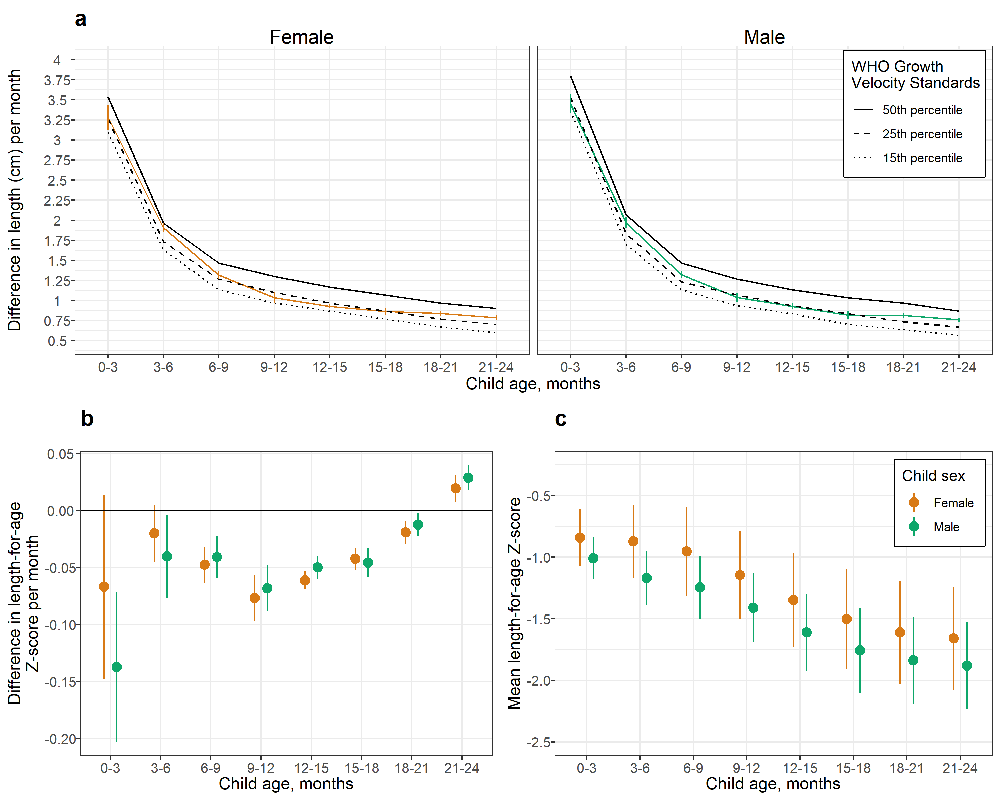

# Analysis with monthly cohorts {#monthly}

---
output:
  pdf_document:
    keep_tex: yes
fontfamily: mathpazo
fontsize: 9pt
---

\raggedright

To explore the influence of differing numbers of cohorts contributing data at different ages, we conducted a sensitivity analysis in which we subset data to cohorts that measured anthropometry monthly from birth to 24 months.

prevalence SE varition: It looks like it it COHORTS Guatemala, which is quarterly measured and has super high stunting prevalence:

<!-- ##################################################################################### -->
## Mean length-for-age Z-score by age

### All eligible cohorts

### Cohorts that measured monthly from birth to 24 months

<!-- ##################################################################################### -->
## Age-specific severe stunting prevalence

### All eligible cohorts

### Cohorts that measured monthly from birth to 24 months

<!-- ##################################################################################### -->
## Age-specific severe stunting incidence

### All eligible cohorts

### Cohorts that measured monthly from birth to 24 months

<!-- ##################################################################################### -->
## Linear growth velocity

### All eligible cohorts

### Cohorts that measured monthly from birth to 24 months

