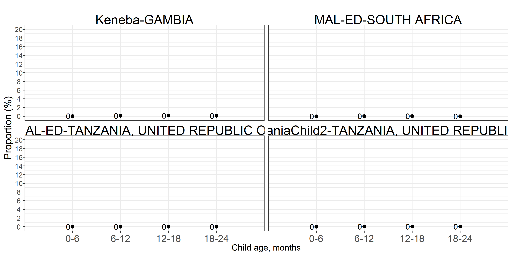
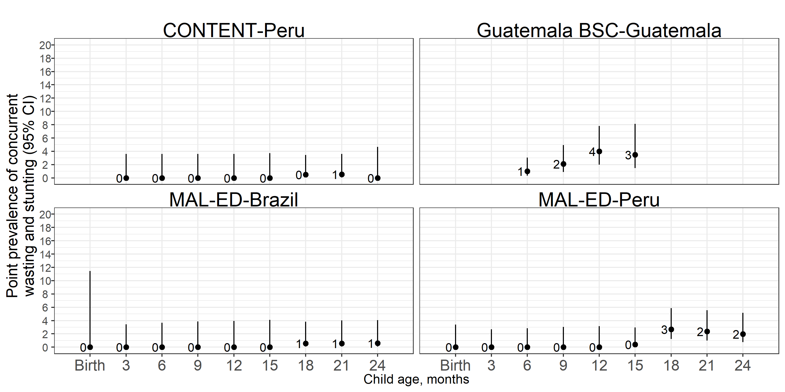

# Cohort-specific estimates {#cohort}

---
output:
  pdf_document:
    keep_tex: yes
fontfamily: mathpazo
fontsize: 9pt
---

\raggedright

Below are the cohort-specific estimates for the age-specific prevalences of wasting, severe wasting, persistent wasting, underweight, and concurrent wasting and stunting.


```{r setup2, include=FALSE}
library(knitr)

```

## Age-specific prevalence

```{r, echo = FALSE}
include_graphics("figure-copies/fig-prev_plot_africa.png")
include_graphics("figure-copies/fig-prev_plot_lam.png")
include_graphics("figure-copies/fig-prev_plot_sasia.png")
```


<!-- ## Age-specific incidence -->

<!-- ```{r, echo = FALSE} -->
<!-- include_graphics("figure-copies/fig-wast-ci-no-Kenaba-BW.png") -->

<!-- ``` -->

<!-- ## Age-specific incidence rate -->

<!-- ```{r, echo = FALSE} -->
<!-- include_graphics("figure-copies/fig-wast-ir-no-Kenaba-BW.png") -->

<!-- ``` -->

<!-- ## Age-specific recovery -->

<!-- ```{r, echo = FALSE} -->
<!-- include_graphics("figure-copies/fig-wast-rec-no-Kenaba-BW.png") -->

<!-- ``` -->

## Age-specific prevalence of severe wasting

```{r, echo = FALSE}
include_graphics("figure-copies/fig-sevwast_plot_africa.png")
include_graphics("figure-copies/fig-sevwast_plot_lam.png")
include_graphics("figure-copies/fig-sevwast_plot_sasia.png")
```

## Age-specific longitudinal prevalence of persistent wasting

```{r, echo = FALSE}

include_graphics("figure-copies/fig-perswast_plot_lam.png")
include_graphics("figure-copies/fig-perswast_plot_sasia.png")

```

## Age-specific prevalence of concurrent wasting and stunting

```{r, echo = FALSE}
include_graphics("figure-copies/fig-co_plot_africa.png")

include_graphics("figure-copies/fig-co_plot_sasia.png")

```

## Age-specific prevalence of underweight (weight-for-age Z-score < -2)

```{r, echo = FALSE}
include_graphics("figure-copies/fig-underweight_plot_africa.png")
include_graphics("figure-copies/fig-underweight_plot_lam.png")
include_graphics("figure-copies/fig-underweight_plot_sasia.png")

```


