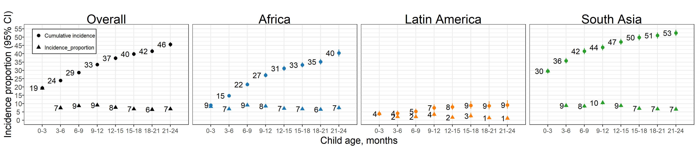

# Sensitivity analysis dropping at-Birth measures in Kenaba {#no-kenaba}

---
output:
  pdf_document:
    keep_tex: yes
fontfamily: mathpazo
fontsize: 9pt
---

\raggedright

-Add discussion of Kenaba birth measuresu and motivation/conclusions of sensitivity analysis

```{r setup3, include=FALSE}
library(knitr)
knitr::opts_chunk$set(echo = TRUE)
# setwd("../../")
# source("0-config.R")
```

## Mean WLZ by region

```{r, echo = FALSE}
# include_graphics(paste0(fig_dir, "wasting/fig-wast-2-prev-overall_region--allage-primary-no-Kenaba-BW.png"))
include_graphics("figure-copies/WLZ_by_region-no-Kenaba-BW.png")
```

## Age-specific prevalence

```{r prev-primary-no-Kenaba-BW, echo = FALSE}
# include_graphics(paste0(fig_dir, "wasting/fig-wast-2-prev-overall_region--allage-primary-no-Kenaba-BW.png"))
include_graphics("figure-copies/fig-wast-prev-no-Kenaba-BW.png")
```


## Age-specific incidence

```{r, echo = FALSE}


```

## Age-specific incidence rate

```{r, echo = FALSE}
include_graphics("figure-copies/fig-wast-ir-no-Kenaba-BW.png")

```

## Age-specific recovery

```{r, echo = FALSE}
include_graphics("figure-copies/fig-wast-rec-no-Kenaba-BW.png")

```

## Age-specific prevalence of severe wasting

```{r, echo = FALSE}
include_graphics("figure-copies/fig-sev-wast-no-Kenaba-BW.png")

```

## Age-specific longitudinal prevalence of persistent wasting

```{r, echo = FALSE}
include_graphics("figure-copies/fig-pers-wast-no-Kenaba-BW.png")

```

## Age-specific prevalence of concurrent wasting and stunting

```{r, echo = FALSE}
include_graphics("figure-copies/fig-co-prev-no-Kenaba-BW.png")

```

## Age-specific prevalence of underweight (weight-for-age Z-score < -2)

```{r, echo = FALSE}
include_graphics("figure-copies/fig-uw-prev-no-Kenaba-BW.png")

```


