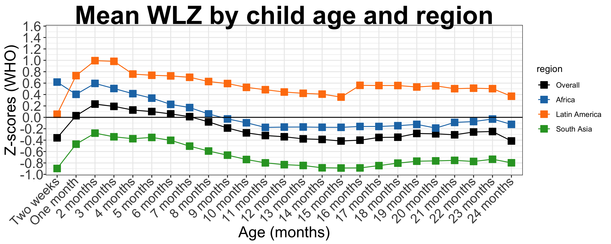
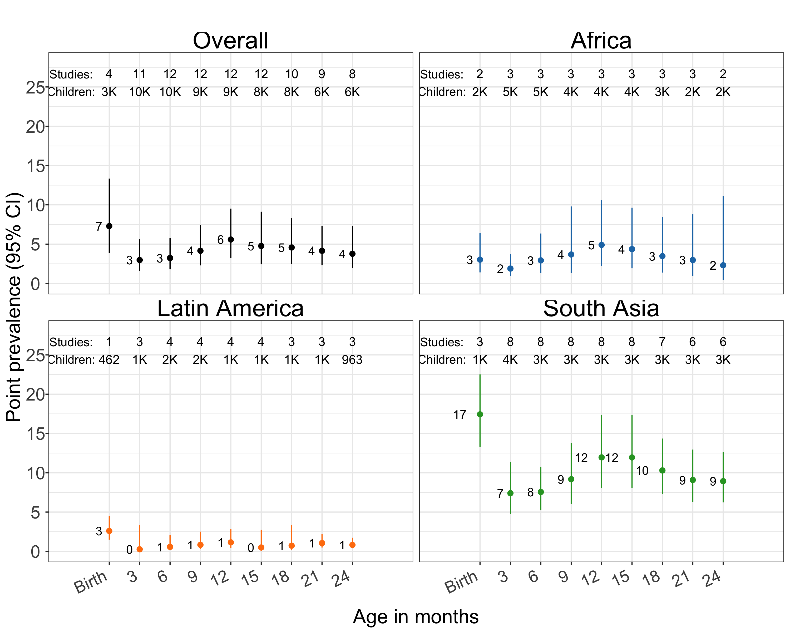

```{r setup, include=FALSE}
knitr::opts_chunk$set(echo = TRUE)
```

```{r, out.width="0.3\\linewidth", include=TRUE, fig.align="center", fig.cap=c("Figure1"), echo=FALSE}
knitr::include_graphics("wasting-study-inventory-heatmap.pdf")
```


# Figure 2



# Figure 3

